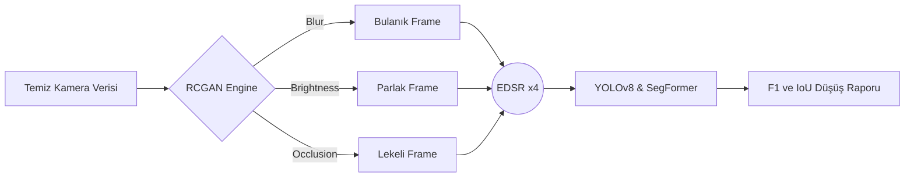
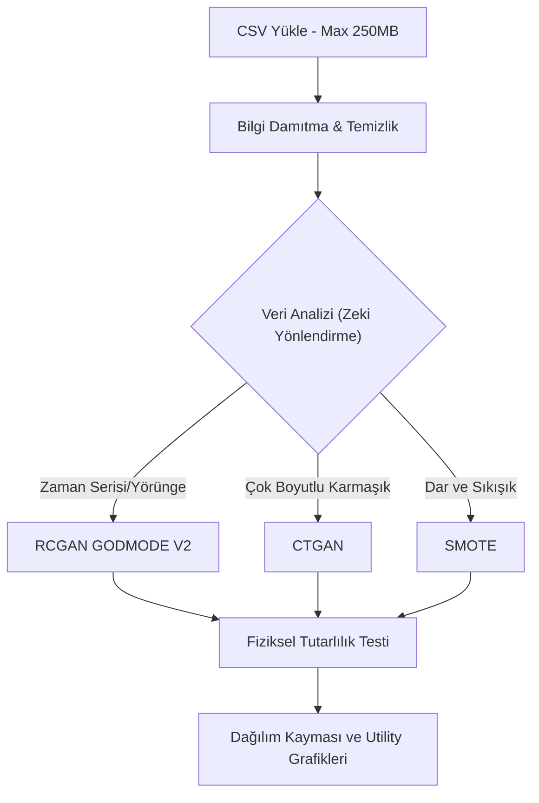

<div align="center">
  
</div>

<br>

<div align="center">
  <h1>🌟 Sentetik Veri Otomasyonu & Dayanıklılık (Robustness) Platformu</h1>
  <p><strong>Otonom sürüş sistemleri ve vizyon modelleri için yeni nesil sentetik veri üretim laboratuvarı.</strong></p>
</div>

<div align="center">
  <a href="https://www.python.org/downloads/"></a>
  <a href="https://pytorch.org/"></a>
  <a href="https://fastapi.tiangolo.com/"></a>
  <a href="https://github.com/ultralytics/ultralytics"></a>
</div>

---

> [!IMPORTANT]
> **Proje Hakkında:** Bu platform, otonom araçların ve yapay zeka algoritmalarının, öngörülemeyen çevre koşullarına (ör. sensör kirlenmesi, kötü hava, beklenmedik yörüngeler) karşı nasıl tepki vereceğini test etmek için tasarlanmıştır. Araştırma düzeyindeki algoritmaları, tek tıkla çalıştırılabilir masaüstü ve web arayüzlerinde birleştirir.

---

## 📖 Kapsamlı Proje Rehberi ve Vizyon

Otonom sürüş dünyasında en büyük problem **"Corner Case"** adı verilen nadir ve tehlikeli durumların veri setlerinde yeterince bulunmamasıdır. Bu platform, elimizdeki sınırlı temiz veriyi alarak; fizik tabanlı simülasyonlar, GAN ağları ve yapay zeka distilasyon teknikleriyle milyonlarca yeni senaryo üretir.

Sistem iki devasa modülden oluşur:
1. **Piksel Tabanlı (Vision) Üretim:** Kameranın körleştiği, kirlendiği veya bulanıklaştığı senaryoları simüle eder.
2. **Koordinat Tabanlı (Trajectory/Tabular) Üretim:** Otonom araçların çılgınca hareket ettiği, yörünge değiştirdiği ve nadir manevralar yaptığı fizik-uyumlu tablolar üretir.

---

## 🏗️ 1. Görüntü Robustness Hattı (Image Pipeline)

Bu hat, yapay zeka destekli otonom kameralarının dış etkenlere karşı dayanıklılığını test eder.

### Nasıl Çalışır?
- **Sentezleme (RCGAN):** Temiz bir kamera görüntüsü alınır. Recurrent Conditional GAN (RCGAN) sayesinde bu görüntüye piksel seviyesinde; Yağmur, Bulanıklık, Güneş Parlaması (Brightness) ve Sensör Kapanması (Occlusion) gibi hatalar doğal bir şekilde işlenir.
- **Keskinleştirme (EDSR):** Üretilen bozuk görüntü, Enhanced Deep Super-Resolution (EDSR) modeli ile yüksek çözünürlüğe ölçeklenir.
- **Sınav Başlıyor (YOLO & SegFormer):** Hem orijinal temiz resim hem de sentetik resim YOLOv8 (nesne tespiti) ve SegFormer (alan bölütleme) algoritmalarına sokulur. Yapay zekanın "bozuk veride" ne kadar körleştiği ölçülür.



---

## 🧠 2. Akıllı Veri Artırımı ve Yörünge Sentezi

Kamera tek başına yetmez! Araçların hızları, koordinatları (x,y) ve yörüngeleri de tablo (CSV) formatında çoğaltılmalıdır. İşte bu hat, devasa CSV verilerini alır ve yapay zeka ile klonlar.

### Teknik Cephanelik
- **RCGAN GODMODE V2 (Physics-Aware):** Yörünge verilerini (örn. Waymo) üretirken aracın fizikten kopmamasını (ışınlanmamasını) sağlar. İvme sınırlarını korur.
- **CTGAN:** Yörünge olmayan genel otonom sensör metriklerini (Örn: Lidar yoğunluğu, motor ısısı) çoğaltmak için özel eğitilmiş GAN motoru.
- **SMOTE + Gaussian:** Veri çok yetersizse araları dolduran klasik ama etkili matematiksel algoritma.



---

## 🚀 Kurulum

Projeyi ilk kez kurmak veya temiz şekilde güncellemek için güncel adımlar ayrı rehberde tutulur:

👉 **[Adım Adım Kurulum Rehberi](KURULUM_REHBERI.md)**

> [!IMPORTANT]
> Büyük model ve veri dosyaları Git LFS ile gelir. Kurulum sırasında rehberdeki `git lfs install` ve `git lfs pull` adımlarını atlamayın. Git LFS kullanılamıyorsa büyük dosyalar [Google Drive](https://drive.google.com/drive/folders/1pCPDsZV1JTMJplXNOtGetRwPa4FKmfk5?usp=drive_link) üzerinden indirilip ilgili klasörlere yerleştirilebilir.

---

## 💻 Kullanım Kılavuzu

Uygulamayı kullanmak son derece basittir. Arayüzler her şeyi sizin için görselleştirir.

### Ana Başlatıcı (Main Launcher)
Her şeyi tek bir menüden yönetmek için sanal ortamınız aktifken (`source env/bin/activate` yapılıyken) şu komutu çalıştırın:
```bash
python main_launcher.py
```
Karşınıza çıkacak menüden "Görüntü Robustness" veya "Veri Artırımı" seçeneklerine tıklayarak ilgili arayüzü başlatabilirsiniz. (Artık iki ayrı arayüz için çift sanal ortam kurmanıza gerek yok, tek ortam her şeye yetiyor).

### Veri Arayüzünü Web Sunucusu Olarak Açma
Eğer sadece analiz sekmesini veya tablo üretimini görmek isterseniz, doğrudan sunucuyu ayağa kaldırabilirsiniz:
```bash
cd akilli_veri_arttirimi
python backend/server.py
```
Tarayıcınızdan `http://127.0.0.1:8000` adresine giderek tamamen yenilenmiş **Analiz ve Karşılaştırma Sekmelerini** görebilirsiniz. 

> [!TIP]
> Analiz sekmesindeki grafikler, sol taraftaki panelde **Orijinal Dağılım** ve sağ taraftaki panelde **Sentetik Veri Dağılımı** olarak dinamik şekilde yüklenmektedir. Hata payları giderilmiş ve responsive (esnek) hale getirilmiştir.

---

## 📊 Analitik Çıktılar ve Raporlama

İşlem bittikten sonra sonuçlar şu dizinlerde toplanır:

1. `/outputs` dizini: Üretilen yepyeni görseller.
2. `/results` dizini: YOLO ve SegFormer'ın ne kadar hata yaptığını gösteren IoU (Kesişim) raporları.
3. `/akilli_veri_arttirimi/outputs` dizini: Üretilen saf `synthetic_output.csv` dosyaları.

*Tüm bu dizinler temiz kalması için `.gitignore` içerisinde gizlenmiştir ve yerel diskinizde depolanır.*

---


## macOS'ta Karşılaşılabilecek Hatalar ve Çözümleri

> [!NOTE]  
> Aşağıdaki çözümlerde geçen `<proje_dizini>` ifadesi, projenin bilgisayarınızdaki kurulu olduğu ana klasör yolunu (Örn: `/Users/aliturhan/Projects/sonproje` veya `C:\Projeler\sentetik_veri_otomasyonu`) temsil etmektedir. Komutları çalıştırırken kendi yolunuzu yazmalısınız.

### Yanlış sanal ortam aktif

Görüntü pipeline'ı proje kökündeki `env` ortamıyla, Akıllı Veri Artırımı ise `akilli_veri_arttirimi/otonom_env` ortamıyla çalıştırılmalıdır. Yanlış ortam aktifse paketler kurulu görünse bile uygulama hata verebilir.

Kontrol:

```bash
which python
```

Görüntü pipeline'ı ve ana launcher için beklenen yol:

```text
<proje_dizini>/env/bin/python
```

Akıllı Veri Artırımı için beklenen yol:

```text
<proje_dizini>/akilli_veri_arttirimi/otonom_env/bin/python
```

Ana proje ortamına dönmek için:

```bash
deactivate
cd <proje_dizini>
source env/bin/activate
```

### `OpenCV dnn_superres` bulunamadı

EDSR upscale için `cv2.dnn_superres` desteği gerekir ve bu destek `opencv-contrib-python` paketiyle gelir. YOLO/Ultralytics tarafı ise bağımlılık kontrolünde `opencv-python` paketini bekler. Bu nedenle iki paket aynı sürümde kurulmalı ve `opencv-contrib-python` en son kurulmalıdır.

Çözüm:

```bash
cd <proje_dizini>
source env/bin/activate
pip uninstall opencv-python opencv-contrib-python opencv-python-headless opencv-contrib-python-headless -y
pip install opencv-python==4.13.0.92
pip install opencv-contrib-python==4.13.0.92
```

Kontrol:

```bash
python -c "import cv2; print(cv2.__version__); print(hasattr(cv2.dnn_superres, 'DnnSuperResImpl_create'))"
```

Son satır `True` dönmelidir.

### `No module named 'transformers'`

SegFormer segmentasyon analizi için Hugging Face Transformers paketi gerekir.

Çözüm:

```bash
cd <proje_dizini>
source env/bin/activate
pip install -r requirements.txt
```

Tek tek kurmak gerekirse:

```bash
pip install transformers safetensors accelerate
```

Kontrol:

```bash
python -c "import transformers; print(transformers.__version__)"
```

### `ModuleNotFoundError: No module named 'PySide6'`

Ana masaüstü arayüzü için PySide6 eksiktir veya yanlış ortam aktiftir.

Çözüm:

```bash
cd <proje_dizini>
source env/bin/activate
pip install -r requirements.txt
```

### `EDSR model dosyası bulunamadı`

`detector/EDSR_x4.pb` dosyası eksiktir veya yanlış klasördedir.

Çözüm:

- `EDSR_x4.pb` dosyasını `detector` klasörüne koyun.
- Arayüzde detector klasörünün doğru seçildiğini kontrol edin.

### SegFormer ilk çalıştırmada model indiremiyor

SegFormer modeli ilk çalıştırmada Hugging Face üzerinden indirilebilir. İnternet yoksa veya model cache'te bulunmuyorsa hata alınabilir.

Çözüm:

- İnternet bağlantısını kontrol edin.
- Modelin daha önce indirilmiş olduğundan emin olun.
- Kurumsal ağ/proxy kullanılıyorsa Hugging Face erişimini kontrol edin.

### Python sürümü uyumluluk hatası

`tensorflow`, `torch`, `opencv-contrib-python` veya `ctgan` kurulurken Python sürümünden kaynaklı hata alınabilir.

Çözüm:

- Ana görüntü pipeline'ı için Python 3.10, 3.11 veya 3.12 kullanın.
- Akıllı Veri Artırımı için de aynı şekilde Python 3.10, 3.11 veya 3.12 ile `otonom_env` ortamını yeniden oluşturun.

### `Port 8000 already in use`

Akıllı Veri Artırımı backend'i için kullanılan `8000` portu başka bir uygulama tarafından kullanılıyor olabilir.

Çözüm:

```bash
lsof -i :8000
```

Gerekirse ilgili süreci kapatın veya farklı port kullanın:

```bash
export SENTETIK_PORT=8001
python akilli_veri_arttirimi/backend/server.py
```

### `There was an error parsing the body` (FastAPI Gövde Ayrıştırma Hatası)

Akıllı Veri Artırımı kısmında CSV yükleyip Sentezi Başlat dediğinizde arayüzde veya loglarda bu hata beliriyorsa, bunun nedeni FastAPI'nin dosya yükleme isteklerini (`multipart/form-data`) ayrıştıramamasıdır.

**Çözüm:**
1. Doğru sanal ortamın (`otonom_env`) aktif olduğundan emin olun.
2. Çakışma yaratan veya eksik yüklenen paketleri temizlemek için terminalde şu komutları sırasıyla çalıştırın:
   ```bash
   source akilli_veri_arttirimi/otonom_env/bin/activate
   pip uninstall multipart python-multipart -y
   pip install python-multipart
   ```

---

## Windows'ta Karşılaşılabilecek Hatalar ve Çözümleri

> [!NOTE]  
> Aşağıdaki çözümlerde geçen `<proje_dizini>` ifadesi, projenin bilgisayarınızdaki kurulu olduğu ana klasör yolunu (Örn: `/Users/aliturhan/Projects/sonproje` veya `C:\Projeler\sentetik_veri_otomasyonu`) temsil etmektedir. Komutları çalıştırırken kendi yolunuzu yazmalısınız.

### `ModuleNotFoundError: No module named 'PySide6'`

Launcher veya masaüstü arayüzü için PySide6 eksiktir.

Çözüm:

```powershell
pip install PySide6
```

### `ModuleNotFoundError: No module named 'PIL'`

Pillow paketi eksiktir. Görüntü okuma işlemlerinde kullanılır.

Çözüm:

```powershell
pip install Pillow
```

### `OpenCV dnn_superres` bulunamadı

EDSR upscale için normal `opencv-python` yeterli değildir. `cv2.dnn_superres` modülü `opencv-contrib-python` paketiyle gelir.

Çözüm:

```powershell
pip uninstall opencv-python opencv-contrib-python opencv-python-headless opencv-contrib-python-headless -y
pip install --no-cache-dir opencv-contrib-python
```

Kontrol:

```powershell
python -c "import cv2; print(cv2.__version__); print(hasattr(cv2.dnn_superres, 'DnnSuperResImpl_create'))"
```

### `EDSR model dosyası bulunamadı`

`detector/EDSR_x4.pb` dosyası eksiktir veya yanlış klasördedir.

Çözüm:

- `EDSR_x4.pb` dosyasını `detector` klasörüne koyun.
- Arayüzde detector klasörünün doğru seçildiğini kontrol edin.

### `Checkpoint bulunamadı`

RCGAN görüntü üretim modeli bulunamamıştır.

Çözüm:

- `checkpoint_epoch_29.pt` dosyasını `rcgan_qt_gui_app_v1` klasörüne koyun.
- Arayüzde checkpoint yolunun doğru olduğunu kontrol edin.

### `YOLO modeli bulunamadı`

YOLO değerlendirmesi için `yolov8n.pt` dosyası eksiktir.

Çözüm:

- `yolov8n.pt` dosyasını `detector` klasörüne koyun.
- Eğer dosya yoksa Ultralytics YOLO modeli indirilmeli veya daha önce indirilmiş model dosyası bu klasöre kopyalanmalıdır.

### `No module named 'ultralytics'`

YOLO paketi kurulu değildir.

Çözüm:

```powershell
pip uninstall -y ultralytics
pip install ultralytics==8.4.48
```

### `No module named 'transformers'`

SegFormer segmentasyon analizi için Hugging Face Transformers paketi eksiktir.

Çözüm:

```powershell
pip install transformers safetensors accelerate
```

### SegFormer ilk çalıştırmada model indiremiyor

SegFormer modeli ilk çalıştırmada Hugging Face üzerinden indirilebilir. İnternet yoksa veya model cache'te bulunmuyorsa hata alınabilir.

Çözüm:

- İnternet bağlantısını kontrol edin.
- Modelin daha önce indirilmiş olduğundan emin olun.
- Kurumsal ağ/proxy kullanılıyorsa Hugging Face erişimini kontrol edin.

### `pywebview` veya Akıllı Veri Artırımı arayüzü açılmıyor

Akıllı veri artırımı arayüzü `pywebview` kullanır. Windows'ta WebView2 Runtime gerekebilir.

Çözüm:

- Microsoft Edge WebView2 Runtime kurulu olmalıdır.
- `pywebview` paketinin kurulu olduğundan emin olun:

```powershell
pip install pywebview
```

### `ctgan` veya `tensorflow` kurulumu uzun sürüyor

Akıllı veri artırımı tarafındaki paketler ağırdır. Özellikle `tensorflow`, `ctgan` ve `torch` kurulumu zaman alabilir.

Çözüm:

- Akıllı veri artırımı için ayrı `otonom_env` kullanın.
- Kurulum bitene kadar terminali kapatmayın.
- Python sürümünün paketlerle uyumlu olduğundan emin olun.

### `Venv Python yanıt vermiyor, sistem Python kullanılacak`

Launcher beklediği sanal ortamı bulamamış veya içindeki Python çalışmamıştır.

Çözüm:

- Görüntü tarafı için `.venv311\Scripts\python.exe` var mı kontrol edin.
- Akıllı veri artırımı için `akilli_veri_arttirimi\otonom_env\Scripts\python.exe` var mı kontrol edin.
- Eski düzende `.venv` kullanıyorsanız `main_launcher.py` içindeki `IMAGE_APP_VENV` satırını `.venv` olarak değiştirin.

### `Port 8000 already in use`

Akıllı veri artırımı backend'i için kullanılan `8000` portu başka bir uygulama tarafından kullanılıyor olabilir.

Çözüm:

PowerShell'de portu kullanan süreci bulun:

```powershell
netstat -ano | findstr :8000
```

Gerekirse ilgili süreci Görev Yöneticisi'nden kapatın veya farklı port kullanmak için:

```powershell
$env:SENTETIK_PORT="8001"
python backend\server.py
```

### Türkçe karakterli Windows kullanıcı yolu sorunları

Bazı eski kütüphaneler Windows yolunda Türkçe karakter olduğunda dosya okuyamayabilir. Projede bazı yerlerde bu durum için güvenli okuma/yazma yöntemleri kullanılmıştır; yine de model dosyası okunamıyorsa sorun dosya yolundan kaynaklanabilir.

Çözüm:

- Model dosyalarının gerçekten var olduğunu kontrol edin.
- Dosyayı proje içindeki beklenen klasöre kopyalayın.
- Çok uzun veya özel karakterli ek klasör yollarından kaçının.

### `There was an error parsing the body` (FastAPI Gövde Ayrıştırma Hatası)

Akıllı Veri Artırımı kısmında CSV yükleyip Sentezi Başlat dediğinizde arayüzde veya loglarda bu hata beliriyorsa, bunun nedeni FastAPI'nin dosya yükleme isteklerini (`multipart/form-data`) ayrıştıramamasıdır.

**Çözüm:**
1. Doğru sanal ortamın (`otonom_env`) aktif olduğundan emin olun.
2. Çakışma yaratan veya eksik yüklenen paketleri temizlemek için PowerShell'de şu komutları sırasıyla çalıştırın:
   ```powershell
   .\akilli_veri_arttirimi\otonom_env\Scripts\activate
   pip uninstall multipart python-multipart -y
   pip install python-multipart
   ```

---

## 📚 Kullanılan Açık Veri Seti: Waymo Open Dataset

Bu projede **Akıllı Veri Artırımı** modülünün temelini oluşturan RCGAN GODMODE modeli, [Waymo Open Dataset](https://waymo.com/open/download/) içerisindeki **Motion Dataset** bölümü kullanılarak eğitilmiştir.

### Neden Waymo Motion Dataset?
Waymo Motion Dataset, Google'ın otonom araç projesi Waymo'dan elde edilen gerçek dünya sürüş verilerini içerir. Bu veri setinde:
* Otonom araçların **x, y, z koordinatları**, **hız**, **yaw açısı** ve **ivme** gibi zaman serisi verileri bulunur
* Gerçek trafik senaryolarındaki araç yörüngeleri, şerit değişimleri ve manevra verileri mevcuttur
* Corner case (nadir ve tehlikeli durum) senaryoları doğal olarak içerilmektedir

### Projede Ne İçin Kullanıldı?
1. **Model Eğitimi:** `waymo_rcgan_GODMODE_V2_PHYSICS_AWARE.pth` modeli bu veri seti üzerinde eğitilmiştir. Model, gerçek araç hareketlerini öğrenerek fiziksel olarak tutarlı sentetik yörünge verileri üretir.
2. **Seed (Tohum) Verisi:** `waymo_seed_MASSIVE.csv` dosyası, Waymo Motion Dataset'ten çıkarılmış 20 adımlık pencere formatındaki yörünge verileridir. RCGAN bu veriyi referans alarak yeni sentetik yörüngeler üretir.
3. **Format Standardı:** Kullanıcının yüklediği CSV verileri otomatik olarak Waymo formatına dönüştürülerek RCGAN ile üretim yapılabilir.

🔗 **[Waymo Open Dataset - Motion Dataset İndirme Sayfası](https://waymo.com/open/download/)**

> Sun, P., et al. (2020). *Scalability in Perception for Autonomous Driving: Waymo Open Dataset.* CVPR 2020.

## 📚 Kullanılan Açık Veri Seti: https://www.kaggle.com/datasets/mitanshuchakrawarty/nuscenes

---
**Geliştiriciler:** Ali Turhan & Özcan Yıldıral | Modern AI Araştırma Laboratuvarı Mimarisi

pip uninstall -y opencv-python opencv-contrib-python opencv-python-headless
pip install --no-cache-dir opencv-python==4.10.0.84 opencv-contrib-python==4.10.0.84

pip uninstall -y pandas numpy
pip install --no-cache-dir "numpy<2.0" "pandas>=2.1.1,<3"
pip install --no-cache-dir --force-reinstall numpy pandas python-dateutil pytz tzdata