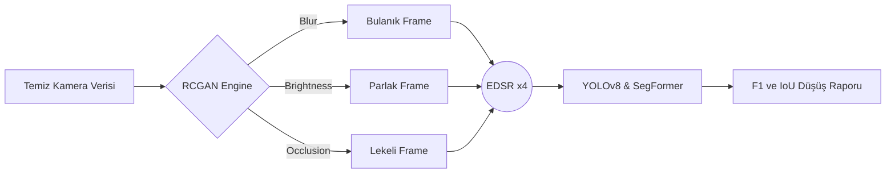
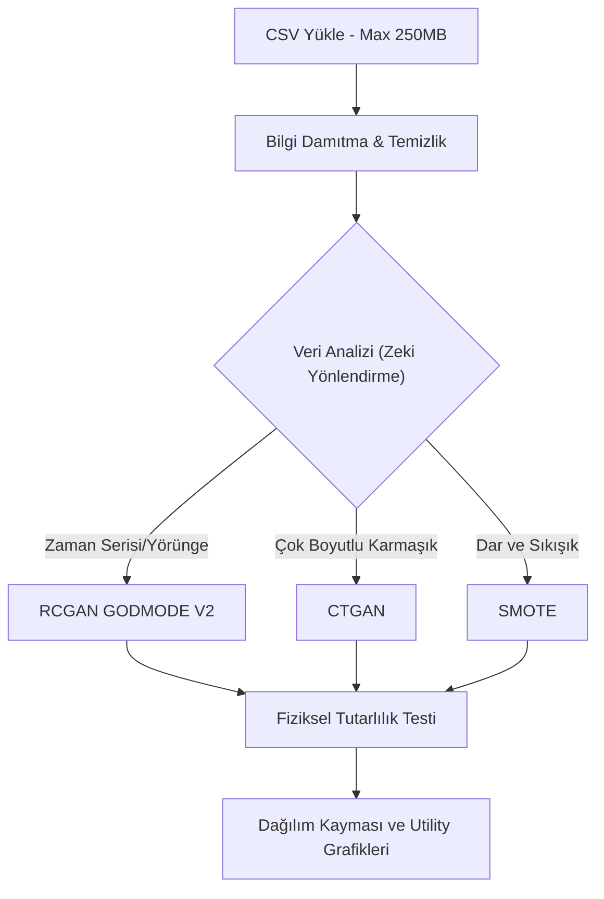

<div align="center">
  
</div>

<br>

<div align="center">
  <h1>🌟 Sentetik Veri Otomasyonu & Dayanıklılık (Robustness) Platformu</h1>
  <p><strong>Otonom sürüş sistemleri ve bilgisayarlı görü (vision) modelleri için yeni nesil sentetik veri üretim ve analiz laboratuvarı.</strong></p>
</div>

<div align="center">
  <a href="https://www.python.org/downloads/"></a>
  <a href="https://pytorch.org/"></a>
  <a href="https://fastapi.tiangolo.com/"></a>
  <a href="https://github.com/ultralytics/ultralytics"></a>
</div>

---

> [!IMPORTANT]
> **Proje Hakkında:** Bu platform, otonom araçların ve yapay zeka algoritmalarının, öngörülemeyen çevre koşullarına (ör. sensör kirlenmesi, kötü hava, beklenmedik yörüngeler) karşı nasıl tepki vereceğini test etmek için tasarlanmıştır. Araştırma düzeyindeki karmaşık algoritmaları, tek tıkla çalıştırılabilir masaüstü (PySide6) ve modern web (FastAPI) arayüzlerinde birleştirir.

---

## 📖 Kapsamlı Proje Rehberi ve Vizyon

Otonom sürüş dünyasında en büyük problem, **"Corner Case"** adı verilen nadir ve tehlikeli durumların gerçek dünya veri setlerinde yeterince bulunmamasıdır. Bu platform, elimizdeki sınırlı ve temiz veriyi alarak; fizik tabanlı simülasyonlar, üretici yapay zeka (GAN) ağları ve bilgi damıtma teknikleriyle milyonlarca yeni senaryo üretir.

Sistem iki ana modülden oluşmaktadır:
1. 🖼️ **Piksel Tabanlı (Vision) Üretim:** Kameraların körleştiği, kirlendiği veya hava muhalefeti nedeniyle bulanıklaştığı senaryoları simüle eder.
2. 📊 **Koordinat Tabanlı (Trajectory/Tabular) Üretim:** Otonom araçların dinamik hareket yaptığı, yörünge değiştirdiği ve nadir sürüş manevraları sergilediği fizik-uyumlu tablolar üretir.

---

## 🏗️ 1. Görüntü Robustness Hattı (Image Pipeline)

Bu hat, yapay zeka destekli otonom kameralarının dış etkenlere karşı dayanıklılığını (robustness) test eder.

### 🔍 Nasıl Çalışır?
* **Sentezleme (RCGAN):** Temiz bir kamera görüntüsü alınır. Recurrent Conditional GAN (RCGAN) sayesinde bu görüntüye piksel seviyesinde; *Yağmur, Bulanıklık, Güneş Parlaması (Brightness) ve Sensör Kapanması (Occlusion)* gibi hatalar doğal bir şekilde işlenir.
* **Keskinleştirme (EDSR):** Üretilen bozuk görüntü, *Enhanced Deep Super-Resolution (EDSR)* modeli ile 4 kat yüksek çözünürlüğe ölçeklenir.
* **Sınav Başlıyor (YOLO & SegFormer):** Hem orijinal temiz resim hem de sentetik resim *YOLOv8* (nesne tespiti) ve *SegFormer* (alan bölütleme) algoritmalarına sokulur. Yapay zekanın "bozuk veride" ne kadar körleştiği akademik metriklerle ölçülür.



---

## 🧠 2. Akıllı Veri Artırımı ve Yörünge Sentezi

Kamera tek başına yetmez! Araçların hızları, koordinatları (x,y) ve yörüngeleri de tablo (CSV) formatında çoğaltılmalıdır. Bu hat, ham sensör ve yörünge verilerini alır ve yapay zeka ile klonlar.

### 🛡️ Teknik Cephanelik
* **RCGAN GODMODE V2 (Physics-Aware):** Yörünge verilerini (örn. Waymo) üretirken aracın fizikten kopmamasını (ışınlanmamasını) sağlar. İvme ve hız sınırlarını korur.
* **CTGAN:** Yörünge olmayan genel otonom sensör metriklerini (Örn: Lidar yoğunluğu, motor ısısı) çoğaltmak için özel eğitilmiş tabular GAN motorudur.
* **SMOTE + Gaussian:** Verinin çok yetersiz olduğu dar senaryolarda araları dolduran ve veri çeşitliliği sağlayan matematiksel interpolasyon algoritmasıdır.



---

## 🚀 Adım Adım Kurulum Rehberi (macOS & Linux)

> [!WARNING]  
> **DİKKAT:** Projenin ana omurgasını oluşturan AI modelleri (Örn: 359 MB'lık `checkpoint_epoch_29.pt` ve devasa `.csv` veri setleri) **boyutları çok büyük olduğu için GitHub'a yüklenmemiştir**. Bu dosyaları ve veri setlerini [Google Drive](https://drive.google.com/drive/folders/1pCPDsZV1JTMJplXNOtGetRwPa4FKmfk5?usp=drive_link) üzerinden indirip ilgili klasörlere yerleştirmeniz gerekmektedir.

### 1️⃣ Projeyi İndirme (Clone)
Terminali açın ve projeyi bilgisayarınıza çekin:
```bash
git clone https://github.com/aliturhan0/sentetik_veri_otomasyonu.git
cd sentetik_veri_otomasyonu
```

### 2️⃣ Sanal Ortam (Virtual Environment) Kurulumu
Proje bağımlılıklarının çakışmaması için temiz bir sanal ortam oluşturun ve aktif edin:
```bash
# Sanal ortam oluşturma:
python3 -m venv env

# Aktif etme:
source env/bin/activate
```

### 3️⃣ Gerekli Kütüphanelerin (Dependencies) Yüklenmesi
Sanal ortamınız aktifken gerekli tüm kütüphaneleri yükleyin:
```bash
pip install -r requirements.txt
```

### 3️⃣B. Ana Klasöre Dönüp `env` Ortamını Yeniden Aktif Etme
`akilli_veri_arttirimi/otonom_env` kurulumu tamamlandıktan sonra terminal hâlâ Akıllı Veri Artırımı ortamında olabilir. Ana launcher'ı veya proje kökündeki dosyaları çalıştırmadan önce ana klasöre dönüp proje kökündeki `env` ortamını yeniden aktif edin.

macOS/Linux için:
```bash
deactivate
cd /Users/ozcan/sentetik_veri_otomasyonu
source env/bin/activate
python main_launcher.py
```

Windows için:
```powershell
deactivate
cd C:\Users\özcan\sentetik_veri_otomasyonu
.\env\Scripts\activate
python main_launcher.py
```

Aktif ortamı kontrol etmek için:
```bash
which python
```
macOS/Linux üzerinde beklenen çıktı proje kökündeki `env` ortamını göstermelidir:
```text
/Users/ozcan/sentetik_veri_otomasyonu/env/bin/python
```

### 4️⃣ Gerekli Model Dosyalarını İndirme
Platformun çalışması için gerekli büyük dosyaları (AI modelleri ve referans veri setleri) aşağıdaki bağlantıdan toplu olarak indirebilirsiniz:

🔗 **[Google Drive - Büyük Proje Dosyaları](https://drive.google.com/drive/folders/1pCPDsZV1JTMJplXNOtGetRwPa4FKmfk5?usp=drive_link)**

İndirdiğiniz dosyaları proje içinde tam olarak şu dizinlere yerleştirmeniz gerekir:
* `rcgan_qt_gui_app_v1/checkpoint_epoch_29.pt` *(Görüntü üretim modeli)*
* `detector/EDSR_x4.pb` *(Yüksek çözünürlük modeli)*
* `detector/yolov8n.pt` *(YOLO test modeli)*
* `akilli_veri_arttirimi/waymo_rcgan_GODMODE_V2_PHYSICS_AWARE.pth` *(Yörünge/Veri üretim modeli)*
* `akilli_veri_arttirimi/waymo_seed_MASSIVE.csv` *(Veri artırımı referans veri seti)*

---

## 💻 Kullanım Kılavuzu

Uygulamayı kullanmak son derece basittir. Geliştirilen arayüzler tüm karmaşık işlemleri sizin için yönetir.

### 🎛️ Ana Başlatıcı (Main Launcher)
Her şeyi tek bir menüden yönetmek için sanal ortamınız aktifken (`source env/bin/activate` yapılıyken) şu komutu çalıştırın:
```bash
python main_launcher.py
```
Karşınıza çıkacak masaüstü menüsünden **"Görüntü Robustness"** veya **"Veri Artırımı"** seçeneklerine tıklayarak ilgili arayüzü başlatabilirsiniz. (Artık iki ayrı arayüz için çift sanal ortam kurmanıza gerek yok, tek ortam her şeye yetiyor).

### 🌐 Veri Arayüzünü Web Sunucusu Olarak Açma
Eğer sadece analiz sekmesini veya tablo üretimini web tarayıcısından görmek isterseniz, doğrudan sunucuyu ayağa kaldırabilirsiniz:
```bash
cd akilli_veri_arttirimi
python backend/server.py
```
Tarayıcınızdan `http://127.0.0.1:8000` adresine giderek tamamen yenilenmiş **Analiz, Karşılaştırma ve Canlı Simülasyon Sekmelerini** görebilirsiniz. 

> [!TIP]
> Analiz sekmesindeki grafikler, sol taraftaki panelde **Orijinal Dağılım** ve sağ taraftaki panelde **Sentetik Veri Dağılımı** olarak dinamik şekilde yüklenmektedir. Hata payları giderilmiş ve responsive (esnek) hale getirilmiştir.

---

## 📊 Analitik Çıktılar ve Raporlama

İşlem tamamlandıktan sonra tüm çıktılar yerel makinenizde şu dizinlerde toplanır:

1. `📂 /outputs` dizini: Üretilen yepyeni görseller.
2. `📂 /results` dizini: YOLO ve SegFormer'ın ne kadar hata yaptığını gösteren IoU (Kesişim) raporları.
3. `📂 /akilli_veri_arttirimi/outputs` dizini: Üretilen saf `synthetic_output.csv` dosyaları.

*Tüm bu dizinler temiz kalması için `.gitignore` içerisinde gizlenmiştir ve yerel diskinizde depolanır.*

---

## 🪟 Windows'ta Projeyi Ayağa Kaldırma

Bu proje Windows üzerinde iki ayrı arayüzle çalışır:
1. **Görüntü Robustness Pipeline**: `rcgan_qt_gui_app_v1` klasöründeki PySide6 arayüzüdür.
2. **Akıllı Veri Artırımı**: `akilli_veri_arttirimi` klasöründeki FastAPI + pywebview web tabanlı arayüzdür.

Mevcut `main_launcher.py` ayarlarına göre sanal ortamlar şu şekilde yapılandırılmalıdır:

| Modül | Beklenen Sanal Ortam Konumu | Açıklama |
| :--- | :--- | :--- |
| **Görüntü Robustness Pipeline** | `.venv311` | `main_launcher.py` şu an görüntü arayüzü için proje kökündeki `.venv311` ortamını arar. |
| **Akıllı Veri Artırımı** | `akilli_veri_arttirimi\otonom_env` | Veri artırımı arayüzü kendi klasöründeki `otonom_env` ortamıyla çalışacak şekilde ayarlanmıştır. |

> [!NOTE]
> Eski kurulumda görüntü arayüzü için `.venv` kullanıyorsanız, `main_launcher.py` içindeki `IMAGE_APP_VENV = PROJECT_ROOT / ".venv311"` satırını `IMAGE_APP_VENV = PROJECT_ROOT / ".venv"` olarak değiştirebilirsiniz.

### 1️⃣ Projeyi İndirme
```powershell
git clone https://github.com/aliturhan0/sentetik_veri_otomasyonu.git
cd sentetik_veri_otomasyonu
```

### 2️⃣ Görüntü Robustness Ortamını Kurma
Mevcut launcher ayarı `.venv311` beklediği için önerilen kurulum adımları:
```powershell
python -m venv .venv311
.\.venv311\Scripts\activate
python -m pip install --upgrade pip
pip install -r requirements.txt
```
Sadece görüntü pipeline'ı için temel paketler şunlardır:
`PySide6`, `Pillow`, `numpy`, `torch`, `torchvision`, `opencv-contrib-python`, `ultralytics`, `transformers`, `safetensors`, `accelerate`, `matplotlib`, `pandas`, `tqdm`, `scipy`. Ana `requirements.txt` dosyasında bu paketler bulunmaktadır.

### 3️⃣ Akıllı Veri Artırımı Ortamını Kurma
Akıllı veri artırımı modülü ayrı ortam kullanacaksa:
```powershell
cd akilli_veri_arttirimi
python -m venv otonom_env
.\otonom_env\Scripts\activate
python -m pip install --upgrade pip
pip install -r requirements.txt
cd ..
```
Bu modül için önemli paketler:
`fastapi`, `uvicorn`, `requests`, `pywebview`, `pandas`, `numpy`, `scikit-learn`, `scipy`, `torch`, `ctgan`, `tensorflow`, `python-multipart`, `matplotlib`. Bu paketler `akilli_veri_arttirimi/requirements.txt` içinde bulunmaktadır.

### 4️⃣ Gerekli Model ve Veri Dosyaları
GitHub'a büyük model ve veri dosyaları yüklenmemiştir. Aşağıdaki dosyalar indirilip ilgili klasörlerde bulunmalıdır:

| Dosya Konumu | İşlevi |
| :--- | :--- |
| `rcgan_qt_gui_app_v1/checkpoint_epoch_29.pt` | RCGAN Görüntü Üretimi |
| `detector/EDSR_x4.pb` | EDSR Görüntü Upscale |
| `detector/yolov8n.pt` | YOLOv8 Değerlendirmesi |
| `akilli_veri_arttirimi/waymo_rcgan_GODMODE_V2_PHYSICS_AWARE.pth` | Tabular RCGAN Sentez Modeli |
| `akilli_veri_arttirimi/waymo_seed_MASSIVE.csv` | Waymo/Yörünge Başlangıç Seed Verisi |

### 5️⃣ Ana Launcher'ı Çalıştırma
Proje kök dizinine dönüp görüntü ortamını aktif edin:
```powershell
cd C:\Users\özcan\sentetik_veri_otomasyonu
.\.venv311\Scripts\activate
python main_launcher.py
```
Açılan menüde:
* **Görüntü Modelini Aç:** RCGAN Robustness Pipeline arayüzünü açar.
* **Veri Artırımı Modelini Aç:** Akıllı Veri Artırımı arayüzünü açar.

### 6️⃣ Arayüzleri Bağımsız Olarak Çalıştırma
Görüntü arayüzünü doğrudan açmak için:
```powershell
.\.venv311\Scripts\activate
cd rcgan_qt_gui_app_v1
python qt_gui_app_updated.py
```
Akıllı veri artırımı arayüzünü doğrudan açmak için:
```powershell
cd akilli_veri_arttirimi
.\otonom_env\Scripts\activate
python main.py
```
Sadece backend'i açmak için:
```powershell
cd akilli_veri_arttirimi
.\otonom_env\Scripts\activate
python backend\server.py
```
Sonra tarayıcıdan `http://127.0.0.1:8000` adresine gidilebilir.

---

## 🛠️ macOS'ta Karşılaşılabilecek Hatalar ve Çözümleri

### ❌ Yanlış sanal ortam aktif
Görüntü pipeline'ı proje kökündeki `env` ortamıyla, Akıllı Veri Artırımı ise `akilli_veri_arttirimi/otonom_env` ortamıyla çalıştırılmalıdır. Yanlış ortam aktifse kütüphaneler kurulu görünse bile hata alınabilir.
* **Kontrol:**
  ```bash
  which python
  ```
* **Görüntü pipeline'ı ve ana launcher için beklenen yol:**
  ```text
  /Users/ozcan/sentetik_veri_otomasyonu/env/bin/python
  ```
* **Akıllı Veri Artırımı için beklenen yol:**
  ```text
  /Users/ozcan/sentetik_veri_otomasyonu/akilli_veri_arttirimi/otonom_env/bin/python
  ```
* **Ana proje ortamına dönmek için:**
  ```bash
  deactivate
  cd /Users/ozcan/sentetik_veri_otomasyonu
  source env/bin/activate
  ```

### ❌ `OpenCV dnn_superres` bulunamadı
EDSR upscale için normal `opencv-python` yeterli değildir. `cv2.dnn_superres` desteği `opencv-contrib-python` paketiyle gelir. Mevcut ortamda `opencv-python` ve `opencv-contrib-python` aynı anda kuruluysa çakışma oluşabilir.
* **Çözüm:**
  ```bash
  cd /Users/ozcan/sentetik_veri_otomasyonu
  source env/bin/activate
  pip uninstall opencv-python opencv-contrib-python opencv-python-headless opencv-contrib-python-headless -y
  pip install --no-cache-dir opencv-contrib-python
  ```
* **Kontrol:**
  ```bash
  python -c "import cv2; print(cv2.__version__); print(hasattr(cv2.dnn_superres, 'DnnSuperResImpl_create'))"
  ```
  *Son satır `True` dönmelidir.*

### ❌ `No module named 'transformers'`
SegFormer segmentasyon analizi için Hugging Face Transformers paketi gerekir.
* **Çözüm:**
  ```bash
  cd /Users/ozcan/sentetik_veri_otomasyonu
  source env/bin/activate
  pip install -r requirements.txt
  ```
  *(Tek tek kurmak gerekirse: `pip install transformers safetensors accelerate`)*
* **Kontrol:**
  ```bash
  python -c "import transformers; print(transformers.__version__)"
  ```

### ❌ `ModuleNotFoundError: No module named 'PySide6'`
Ana masaüstü arayüzü için PySide6 eksiktir veya yanlış ortam aktiftir.
* **Çözüm:**
  ```bash
  cd /Users/ozcan/sentetik_veri_otomasyonu
  source env/bin/activate
  pip install -r requirements.txt
  ```

### ❌ `EDSR model dosyası bulunamadı`
`detector/EDSR_x4.pb` dosyası eksiktir veya yanlış klasördedir.
* **Çözüm:**
  * `EDSR_x4.pb` dosyasını `detector` klasörüne koyun.
  * Arayüzde detector klasörünün doğru seçildiğini kontrol edin.

### ❌ SegFormer ilk çalıştırmada model indiremiyor
SegFormer modeli ilk çalıştırmada Hugging Face üzerinden indirilir. İnternet yoksa veya model cache'te bulunmuyorsa hata alınabilir.
* **Çözüm:**
  * İnternet bağlantısını kontrol edin.
  * Modelin daha önce indirilmiş olduğundan emin olun.
  * Kurumsal ağ veya proxy kullanılıyorsa Hugging Face erişimini kontrol edin.

### ❌ Python sürümü uyumluluk hatası
`tensorflow`, `torch`, `opencv-contrib-python` veya `ctgan` kurulurken Python sürümünden kaynaklı hata alınabilir.
* **Çözüm:**
  * Ana görüntü pipeline'ı için Python 3.10, 3.11 veya 3.12 kullanın.
  * Akıllı Veri Artırımı için de aynı şekilde Python 3.10, 3.11 veya 3.12 ile `otonom_env` ortamını yeniden oluşturun.

### ❌ `Port 8000 already in use`
Akıllı Veri Artırımı backend'i için kullanılan `8000` portu başka bir uygulama tarafından kullanılıyor olabilir.
* **Çözüm:**
  ```bash
  lsof -i :8000
  ```
  Gerekirse ilgili süreci kapatın veya farklı port kullanın:
  ```bash
  export SENTETIK_PORT=8001
  python akilli_veri_arttirimi/backend/server.py
  ```

---

## 🛠️ Windows'ta Karşılaşılabilecek Hatalar ve Çözümleri

### ❌ `ModuleNotFoundError: No module named 'PySide6'`
Launcher veya masaüstü arayüzü için PySide6 eksiktir.
* **Çözüm:**
  ```powershell
  pip install PySide6
  ```

### ❌ `ModuleNotFoundError: No module named 'PIL'`
Pillow paketi eksiktir. Görüntü okuma işlemlerinde kullanılır.
* **Çözüm:**
  ```powershell
  pip install Pillow
  ```

### ❌ `OpenCV dnn_superres` bulunamadı
EDSR upscale için normal `opencv-python` yeterli değildir. `cv2.dnn_superres` modülü `opencv-contrib-python` paketiyle gelir.
* **Çözüm:**
  ```powershell
  pip uninstall opencv-python opencv-contrib-python opencv-python-headless opencv-contrib-python-headless -y
  pip install --no-cache-dir opencv-contrib-python
  ```
* **Kontrol:**
  ```powershell
  python -c "import cv2; print(cv2.__version__); print(hasattr(cv2.dnn_superres, 'DnnSuperResImpl_create'))"
  ```

### ❌ `EDSR model dosyası bulunamadı`
`detector/EDSR_x4.pb` dosyası eksiktir veya yanlış klasördedir.
* **Çözüm:**
  * `EDSR_x4.pb` dosyasını `detector` klasörüne koyun.
  * Arayüzde detector klasörünün doğru seçildiğini kontrol edin.

### ❌ `Checkpoint bulunamadı`
RCGAN görüntü üretim modeli bulunamamıştır.
* **Çözüm:**
  * `checkpoint_epoch_29.pt` dosyasını `rcgan_qt_gui_app_v1` klasörüne koyun.
  * Arayüzde checkpoint yolunun doğru olduğunu kontrol edin.

### ❌ `YOLO modeli bulunamadı`
YOLO değerlendirmesi için `yolov8n.pt` dosyası eksiktir.
* **Çözüm:**
  * `yolov8n.pt` dosyasını `detector` klasörüne koyun.
  * Eğer dosya yoksa Ultralytics YOLO modeli indirilmelidir.

### ❌ `No module named 'ultralytics'`
YOLO paketi kurulu değildir.
* **Çözüm:**
  ```powershell
  pip install ultralytics
  ```

### ❌ `No module named 'transformers'`
SegFormer segmentasyon analizi için Hugging Face Transformers paketi eksiktir.
* **Çözüm:**
  ```powershell
  pip install transformers safetensors accelerate
  ```

### ❌ SegFormer ilk çalıştırmada model indiremiyor
SegFormer modeli ilk çalıştırmada Hugging Face üzerinden indirilir. İnternet yoksa veya model cache'te bulunmuyorsa hata alınabilir.
* **Çözüm:**
  * İnternet bağlantısını kontrol edin.
  * Kurumsal ağ/proxy kullanılıyorsa Hugging Face erişimini kontrol edin.

### ❌ `pywebview` veya Akıllı Veri Artırımı arayüzü açılmıyor
Akıllı veri artırımı arayüzü `pywebview` kullanır. Windows'ta WebView2 Runtime gerekebilir.
* **Çözüm:**
  * Microsoft Edge WebView2 Runtime kurulu olmalıdır.
  * `pywebview` paketinin kurulu olduğundan emin olun:
    ```powershell
    pip install pywebview
    ```

### ❌ `ctgan` veya `tensorflow` kurulumu uzun sürüyor
Akıllı veri artırımı tarafındaki paketler ağırdır. Özellikle `tensorflow`, `ctgan` ve `torch` kurulumu zaman alabilir.
* **Çözüm:**
  * Akıllı veri artırımı için ayrı `otonom_env` kullanın.
  * Kurulum bitene kadar terminali kapatmayın.
  * Python sürümünün paketlerle uyumlu olduğundan emin olun.

### ❌ `Venv Python yanıt vermiyor, sistem Python kullanılacak`
Launcher beklediği sanal ortamı bulamamış veya içindeki Python çalışmamıştır.
* **Çözüm:**
  * Görüntü tarafı için `.venv311\Scripts\python.exe` var mı kontrol edin.
  * Akıllı veri artırımı için `akilli_veri_arttirimi\otonom_env\Scripts\python.exe` var mı kontrol edin.
  * Eski düzende `.venv` kullanıyorsanız `main_launcher.py` içindeki `IMAGE_APP_VENV` satırını `.venv` olarak değiştirin.

### ❌ `Port 8000 already in use`
Akıllı veri artırımı backend'i için kullanılan `8000` portu başka bir uygulama tarafından kullanılıyor olabilir.
* **Çözüm:**
  * PowerShell'de portu kullanan süreci bulun:
    ```powershell
    netstat -ano | findstr :8000
    ```
  * Gerekirse ilgili süreci Görev Yöneticisi'nden kapatın veya farklı port kullanmak için:
    ```powershell
    $env:SENTETIK_PORT="8001"
    python backend\server.py
    ```

### ❌ Türkçe karakterli Windows kullanıcı yolu sorunları
Bazı eski kütüphaneler Windows yolunda Türkçe karakter olduğunda dosya okuyamayabilir. Projede bazı yerlerde bu durum için güvenli okuma/yazma yöntemleri kullanılmıştır; yine de model dosyası okunamıyorsa sorun dosya yolundan kaynaklanabilir.
* **Çözüm:**
  * Model dosyalarının gerçekten var olduğunu kontrol edin.
  * Dosyayı proje içindeki beklenen klasöre kopyalayın.
  * Çok uzun veya özel karakterli ek klasör yollarından kaçının.

---
<div align="center">
  <sub>Geliştiriciler: <strong>Ali Turhan & Özcan Yıldıral</strong> | Modern AI Araştırma Laboratuvarı Mimarisi</sub>
</div>
