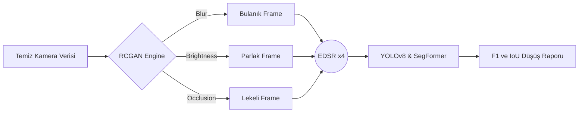
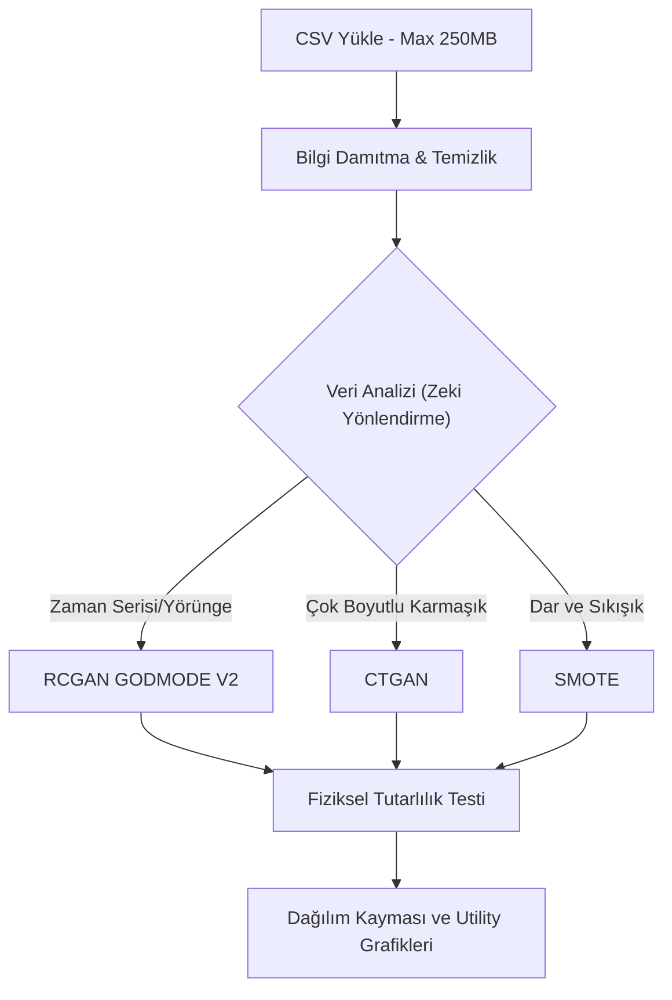

<div align="center">
  
</div>

<br>

<div align="center">
  <h1>🌟 Sentetik Veri Otomasyonu & Dayanıklılık (Robustness) Platformu</h1>
  <p><strong>Otonom sürüş sistemleri ve vizyon modelleri için yeni nesil sentetik veri üretim laboratuvarı.</strong></p>
</div>

<div align="center">
  <a href="https://www.python.org/downloads/"></a>
  <a href="https://pytorch.org/"></a>
  <a href="https://fastapi.tiangolo.com/"></a>
  <a href="https://github.com/ultralytics/ultralytics"></a>
</div>

---

> [!IMPORTANT]
> **Proje Hakkında:** Bu platform, otonom araçların ve yapay zeka algoritmalarının, öngörülemeyen çevre koşullarına (ör. sensör kirlenmesi, kötü hava, beklenmedik yörüngeler) karşı nasıl tepki vereceğini test etmek için tasarlanmıştır. Araştırma düzeyindeki algoritmaları, tek tıkla çalıştırılabilir masaüstü ve web arayüzlerinde birleştirir.

---

## 📖 Kapsamlı Proje Rehberi ve Vizyon

Otonom sürüş dünyasında en büyük problem **"Corner Case"** adı verilen nadir ve tehlikeli durumların veri setlerinde yeterince bulunmamasıdır. Bu platform, elimizdeki sınırlı temiz veriyi alarak; fizik tabanlı simülasyonlar, GAN ağları ve yapay zeka distilasyon teknikleriyle milyonlarca yeni senaryo üretir.

Sistem iki devasa modülden oluşur:
1. **Piksel Tabanlı (Vision) Üretim:** Kameranın körleştiği, kirlendiği veya bulanıklaştığı senaryoları simüle eder.
2. **Koordinat Tabanlı (Trajectory/Tabular) Üretim:** Otonom araçların çılgınca hareket ettiği, yörünge değiştirdiği ve nadir manevralar yaptığı fizik-uyumlu tablolar üretir.

---

## 🏗️ 1. Görüntü Robustness Hattı (Image Pipeline)

Bu hat, yapay zeka destekli otonom kameralarının dış etkenlere karşı dayanıklılığını test eder.

### Nasıl Çalışır?
- **Sentezleme (RCGAN):** Temiz bir kamera görüntüsü alınır. Recurrent Conditional GAN (RCGAN) sayesinde bu görüntüye piksel seviyesinde; Yağmur, Bulanıklık, Güneş Parlaması (Brightness) ve Sensör Kapanması (Occlusion) gibi hatalar doğal bir şekilde işlenir.
- **Keskinleştirme (EDSR):** Üretilen bozuk görüntü, Enhanced Deep Super-Resolution (EDSR) modeli ile yüksek çözünürlüğe ölçeklenir.
- **Sınav Başlıyor (YOLO & SegFormer):** Hem orijinal temiz resim hem de sentetik resim YOLOv8 (nesne tespiti) ve SegFormer (alan bölütleme) algoritmalarına sokulur. Yapay zekanın "bozuk veride" ne kadar körleştiği ölçülür.



---

## 🧠 2. Akıllı Veri Artırımı ve Yörünge Sentezi

Kamera tek başına yetmez! Araçların hızları, koordinatları (x,y) ve yörüngeleri de tablo (CSV) formatında çoğaltılmalıdır. İşte bu hat, devasa CSV verilerini alır ve yapay zeka ile klonlar.

### Teknik Cephanelik
- **RCGAN GODMODE V2 (Physics-Aware):** Yörünge verilerini (örn. Waymo) üretirken aracın fizikten kopmamasını (ışınlanmamasını) sağlar. İvme sınırlarını korur.
- **CTGAN:** Yörünge olmayan genel otonom sensör metriklerini (Örn: Lidar yoğunluğu, motor ısısı) çoğaltmak için özel eğitilmiş GAN motoru.
- **SMOTE + Gaussian:** Veri çok yetersizse araları dolduran klasik ama etkili matematiksel algoritma.



---

## 🚀 Adım Adım Kurulum Rehberi

> [!WARNING]  
> **DİKKAT:** Projenin ana omurgasını oluşturan AI modelleri (Örn: 359 MB'lık `checkpoint_epoch_29.pt` ve devasa `.csv` veri setleri) **boyutları çok büyük olduğu için GitHub'a yüklenmemiştir**. Projeyi klonladıktan sonra bu dosyaları manuel olarak indirip ilgili klasörlere koymanız gerekmektedir.

### 1. Projeyi İndirme (Clone)
Terminali açın ve projeyi bilgisayarınıza çekin:
```bash
git clone https://github.com/aliturhan0/sentetik_veri_otomasyonu.git
cd sentetik_veri_otomasyonu
```

### 2. Sanal Ortam (Virtual Environment) Kurulumu
Bilgisayarınızdaki diğer projelerle kütüphanelerin çakışmaması için boş bir ortam oluşturun:
```bash
# Mac/Linux için:
python3 -m venv env
source env/bin/activate

# Windows için:
python -m venv env
env\Scripts\activate
```

### 3. Gerekli Kütüphanelerin (Dependencies) Yüklenmesi
Projeyi çalıştırmak için gerekli olan tüm kütüphaneler ana dizindeki `requirements.txt` dosyasında mevcuttur. Kurulumu tek seferde yapın:
```bash
pip install -r requirements.txt
```

### 4. Gerekli Model Dosyalarını İndirme
Platformun çalışması için gerekli model dosyalarını (Eğer sizinle paylaşıldıysa Google Drive / OneDrive üzerinden) indirip proje içinde şu dizinlere yerleştirmeniz gerekir:
- `rcgan_qt_gui_app_v1/checkpoint_epoch_29.pt` *(Görüntü üretim modeli)*
- `detector/EDSR_x4.pb` *(Yüksek çözünürlük modeli)*
- `detector/yolov8n.pt` *(YOLO test modeli)*
- `akilli_veri_arttirimi/waymo_rcgan_GODMODE_V2_PHYSICS_AWARE.pth` *(Yörünge/Veri üretim modeli)*
- `akilli_veri_arttirimi/waymo_seed_MASSIVE.csv` *(Veri artırımı referans veri seti)*

---

## 💻 Kullanım Kılavuzu

Uygulamayı kullanmak son derece basittir. Arayüzler her şeyi sizin için görselleştirir.

### Ana Başlatıcı (Main Launcher)
Her şeyi tek bir menüden yönetmek için sanal ortamınız aktifken (`source env/bin/activate` yapılıyken) şu komutu çalıştırın:
```bash
python main_launcher.py
```
Karşınıza çıkacak menüden "Görüntü Robustness" veya "Veri Artırımı" seçeneklerine tıklayarak ilgili arayüzü başlatabilirsiniz. (Artık iki ayrı arayüz için çift sanal ortam kurmanıza gerek yok, tek ortam her şeye yetiyor).

### Veri Arayüzünü Web Sunucusu Olarak Açma
Eğer sadece analiz sekmesini veya tablo üretimini görmek isterseniz, doğrudan sunucuyu ayağa kaldırabilirsiniz:
```bash
cd akilli_veri_arttirimi
python backend/server.py
```
Tarayıcınızdan `http://127.0.0.1:8000` adresine giderek tamamen yenilenmiş **Analiz ve Karşılaştırma Sekmelerini** görebilirsiniz. 

> [!TIP]
> Analiz sekmesindeki grafikler, sol taraftaki panelde **Orijinal Dağılım** ve sağ taraftaki panelde **Sentetik Veri Dağılımı** olarak dinamik şekilde yüklenmektedir. Hata payları giderilmiş ve responsive (esnek) hale getirilmiştir.

---

## 📊 Analitik Çıktılar ve Raporlama

İşlem bittikten sonra sonuçlar şu dizinlerde toplanır:

1. `/outputs` dizini: Üretilen yepyeni görseller.
2. `/results` dizini: YOLO ve SegFormer'ın ne kadar hata yaptığını gösteren IoU (Kesişim) raporları.
3. `/akilli_veri_arttirimi/outputs` dizini: Üretilen saf `synthetic_output.csv` dosyaları.

*Tüm bu dizinler temiz kalması için `.gitignore` içerisinde gizlenmiştir ve yerel diskinizde depolanır.*

---
**Geliştirici:** Ali Turhan & Ekibi | Modern AI Araştırma Laboratuvarı Mimarisi
