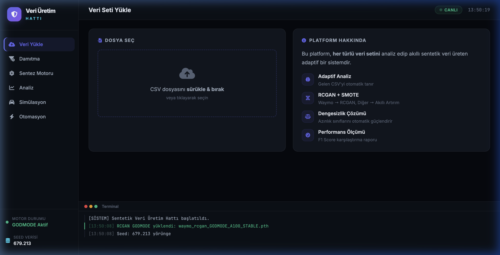
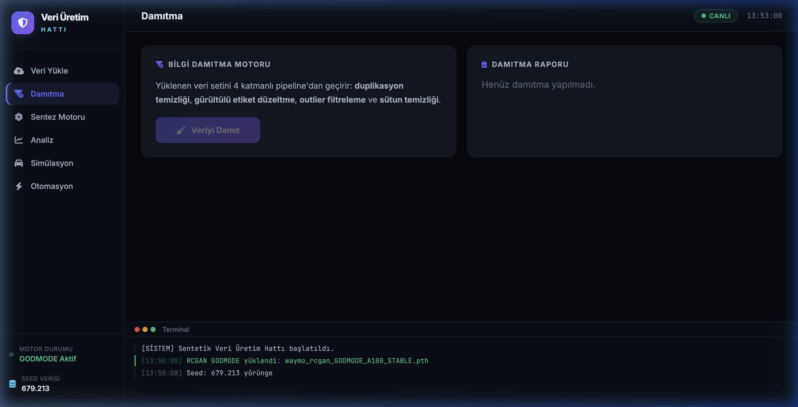
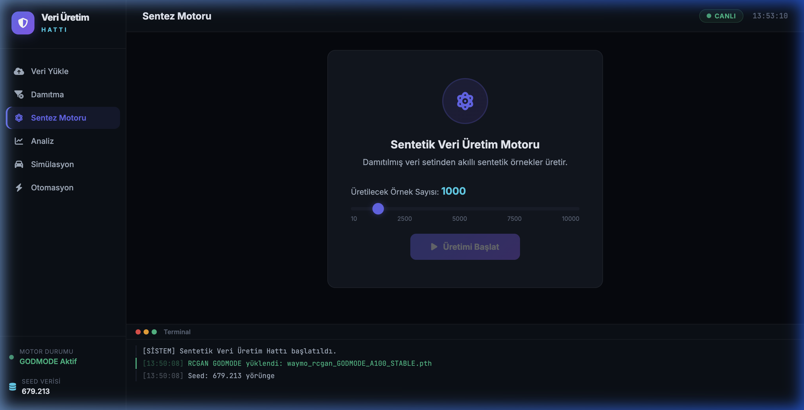
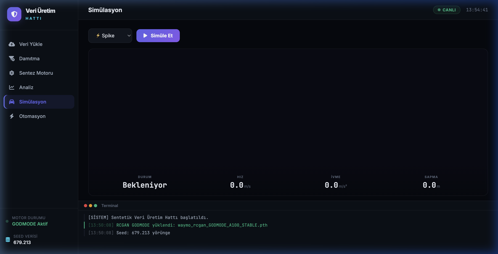
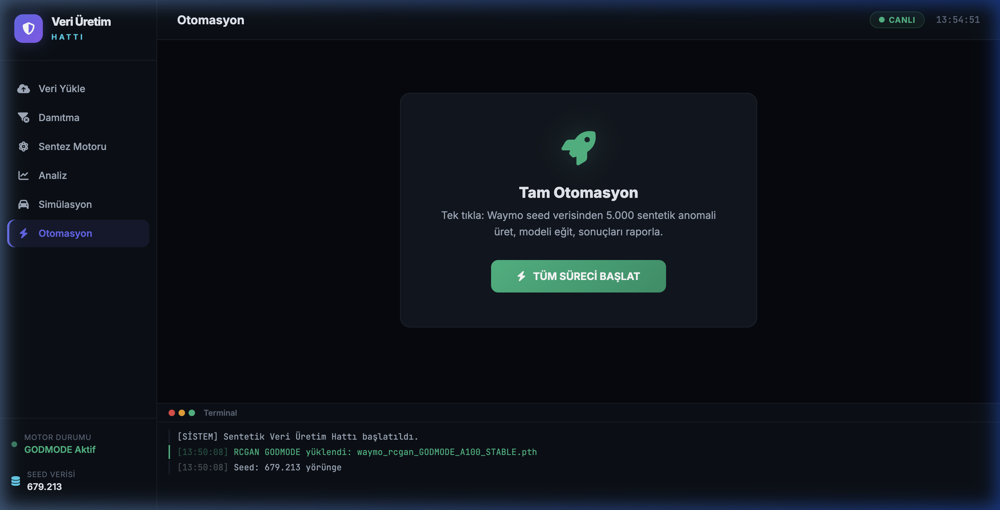
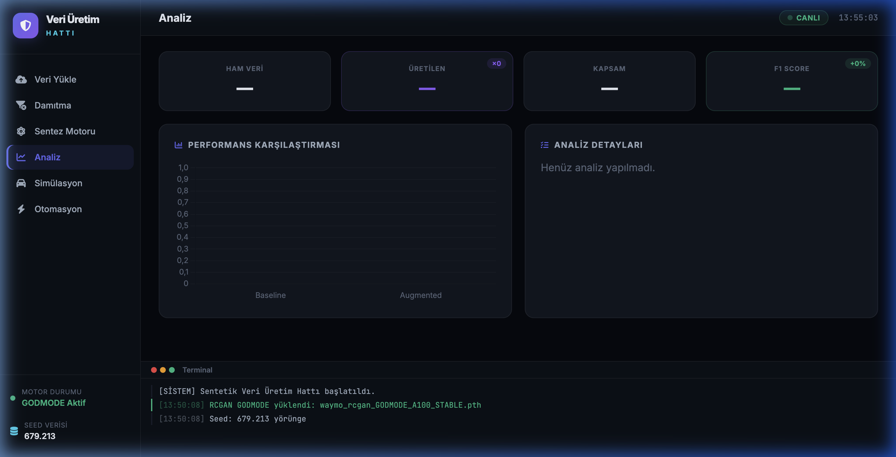

<p align="center">
  
</p>

<h1 align="center">🛡️ Akıllı Sentetik Veri Artırım Platformu</h1>

<p align="center">
  <strong>Bilgi Damıtma + Adaptif GAN Tabanlı Sentetik Veri Üretim Hattı</strong>
</p>

<p align="center">
  
  
  
  
  
  
</p>

---

## 📋 Proje Özeti

Bu platform, **otonom araç güvenliği** ve **endüstriyel anomali tespiti** senaryoları için geliştirilmiş, uçtan uca çalışan bir **sentetik veri üretim hattıdır**. Gerçek dünya veri setlerini otomatik olarak analiz eder, temizler ve yüksek kaliteli sentetik veriler üreterek makine öğrenmesi modellerinin performansını artırır.

### 🎯 Temel Hedefler
- **Veri Dengesizliği Çözümü**: Azınlık sınıflarını akıllı sentetik artırımla güçlendirme
- **F1 Score Hedefi**: ≥%15 iyileştirme (Seed → Augmented)
- **Azınlık Recall Hedefi**: ≥%80 minority class recall
- **Fiziksel Tutarlılık**: Üretilen verilerin fiziksel gerçeklikle uyumlu olması

---

## 🏗️ Sistem Mimarisi

```
┌──────────────────────────────────────────────────────────────────┐
│                    📊 Veri Girişi (CSV)                          │
│          Waymo / GPS / IMU / Endüstriyel Sensör Verisi           │
└──────────────────────┬───────────────────────────────────────────┘
                       │
                       ▼
┌──────────────────────────────────────────────────────────────────┐
│              🧪 4 Katmanlı Bilgi Damıtma Motoru                  │
│  ┌─────────────┐ ┌──────────────┐ ┌──────────┐ ┌─────────────┐  │
│  │ Duplikasyon  │ │ Etiket       │ │ Outlier  │ │ Sütun       │  │
│  │ Temizliği    │→│ Düzeltme     │→│ Filtreleme│→│ Temizliği   │  │
│  │ (Exact+Near) │ │ (KNN-based)  │ │(IQR)     │ │ (Variance)  │  │
│  └─────────────┘ └──────────────┘ └──────────┘ └─────────────┘  │
└──────────────────────┬───────────────────────────────────────────┘
                       │
                       ▼
┌──────────────────────────────────────────────────────────────────┐
│              🔀 Akıllı Yönlendirme Motoru                        │
│                                                                  │
│   Waymo Format? ──Yes──▶ RCGAN GODMODE (Pre-trained)             │
│        │                                                         │
│        No ── Koordinat Verisi? ──Yes──▶ Dönüştür → RCGAN         │
│                    │                                             │
│                    No ── ≥100 satır? ──Yes──▶ CTGAN (On-the-fly) │
│                              │                                   │
│                              No ──▶ SMOTE + Gaussian Noise       │
└──────────────────────┬───────────────────────────────────────────┘
                       │
                       ▼
┌──────────────────────────────────────────────────────────────────┐
│           📈 Akademik Değerlendirme Motoru                       │
│                                                                  │
│   Fidelity          │    Utility                                 │
│   • Cosine Sim.     │    • Seed F1 vs Augmented F1               │
│   • Sütun Korelasyon│    • Sınıf Bazlı F1 Skorları               │
│   • Dağılım Örtüşme │    • Azınlık Sınıfı Recall                │
│                     │    • F1 İyileştirme Yüzdesi                │
└──────────────────────────────────────────────────────────────────┘
```

---

## 🖥️ Platform Arayüzü

### 📤 Veri Yükleme
CSV dosyalarını sürükle-bırak ile yükleyin. Platform, gelen veri setini otomatik olarak tanır ve uygun pipeline'a yönlendirir.

<p align="center">
  
</p>

---

### 🧪 Bilgi Damıtma
4 katmanlı damıtma motoru: duplikasyon temizliği, gürültülü etiket düzeltme (KNN tabanlı), istatistiksel outlier filtreleme ve sıfır-varyans sütun temizliği.

<p align="center">
  
</p>

---

### ⚛️ Sentez Motoru
Damıtılmış veriden 10 ile 10.000 arası sentetik örnek üretin. Motor otomatik olarak RCGAN, CTGAN veya SMOTE arasından en uygun yöntemi seçer.

<p align="center">
  
</p>

---

### 🚗 Anomali Simülasyonu
Üretilen sentetik yörüngeleri gerçek zamanlı olarak simüle edin. 5 anomali tipi desteklenir: **Spike**, **Drift**, **Freeze**, **Dropout**, **Noise**.

<p align="center">
  
</p>

---

### ⚡ Tam Otomasyon
Tek tıkla tüm pipeline'ı çalıştırın: Seed verisini yükle → Damıt → Sentezle → Modeli Eğit → Raporla.

<p align="center">
  
</p>

---

### 📊 Analiz & Değerlendirme
Performans karşılaştırması (Baseline vs Augmented), Fidelity metrikleri, Utility metrikleri ve detaylı rapor.

<p align="center">
  
</p>

---

## 🧠 Üretim Motorları

### 1. RCGAN GODMODE (Recurrent Conditional GAN)
- **Mimari**: 3 katmanlı Bidirectional LSTM (512 hidden) + Label Embedding
- **Eğitim**: Waymo Open Dataset üzerinde A100 GPU'da eğitilmiş
- **Çıktı**: 20 adımlı yörünge pencereleri (x, y, speed, vx, vy)
- **Anomali Üretimi**: Spike, Drift, Dropout, Freeze, Noise — fiziksel olarak tutarlı
- **Baseline Beyin**: `outputs/waymo_rcgan_GODMODE_A100_STABLE.pth` korunur ve varsayılan olarak kullanılır
- **V2 Planı**: `scripts/07_train_rcgan_v2_physics_aware_colab.py` ile ayrı bir physics-aware model eğitilir; başarılı olursa `SENTETIK_RCGAN_MODEL_PATH` ile devreye alınır

### 2. CTGAN (Conditional Tabular GAN)
- **Kullanım**: Genel veri setleri (sensör, IoT, endüstriyel)
- **Özellik**: On-the-fly eğitim — her veri setine otomatik adapte olur
- **Akıllı Örnekleme**: 10K satır üzeri verilerde stratified sampling
- **Epoch Adaptasyonu**: Veri boyutuna göre otomatik epoch ayarı

### 3. SMOTE + Gaussian Noise (Fallback)
- **Kullanım**: Küçük veri setleri veya CTGAN başarısız olduğunda
- **Yöntem**: K-NN tabanlı SMOTE interpolasyon + sınıf-spesifik Gaussian pertürbasyon

---

## 🔄 Akıllı Yörünge Dönüştürücü

Platform, **herhangi bir koordinat/pozisyon/hareket verisini** otomatik olarak Waymo formatına dönüştürebilir:

| Kaynak Veri Tipi | Desteklenen Sütunlar |
|---|---|
| **GPS/Konum** | `lat/lon`, `pos_x/pos_y`, `latitude/longitude` |
| **Hız** | `speed`, `velocity`, `vel_x/vel_y` |
| **IMU/Sensör** | Akıllı ayırt etme — sensör verisi CTGAN'a yönlendirilir |

Dönüştürücü, saf yörünge verisini tespit ederse RCGAN'a, zengin sensör verisi varsa CTGAN'a otomatik yönlendirir.

---

## 🛡️ Güvenlik Katmanları

| Katman | Koruma |
|---|---|
| **Domain Shift Koruması** | Üretilen veri, orijinalin fiziksel sınırlarına (min-max + %5 pay) kliplenir |
| **NaN/Infinity Koruması** | Tüm API yanıtları sanitize edilir |
| **Bozuk CSV Onarımı** | Excel/Numbers tarafından bozulan CSV'ler otomatik onarılır |
| **Sıfıra Bölme Koruması** | Tüm matematiksel işlemlerde epsilon değeri kullanılır |
| **RCGAN Rollback** | Baseline `.pth` dosyası ezilmez; V2 model ayrı dosyaya kaydedilir |
| **RCGAN Post-Process** | Smoothing, velocity coherence, fiziksel validator ve diversity filtresi |

---

## 🧪 RCGAN V2 Eğitim ve Karşılaştırma

Baseline model korunur:

```text
outputs/waymo_rcgan_GODMODE_A100_STABLE.pth
```

Yeni model ayrı dosya olarak eğitilir:

```text
outputs/waymo_rcgan_GODMODE_V2_PHYSICS_AWARE.pth
```

Colab A100 üzerinde V2 eğitimi:

```bash
python akilli_veri_arttirimi/scripts/07_train_rcgan_v2_physics_aware_colab.py
```

V2 modeli baseline ile karşılaştırma:

```bash
python akilli_veri_arttirimi/scripts/08_compare_rcgan_models.py \
  --baseline akilli_veri_arttirimi/outputs/waymo_rcgan_GODMODE_A100_STABLE.pth \
  --candidate akilli_veri_arttirimi/outputs/waymo_rcgan_GODMODE_V2_PHYSICS_AWARE.pth \
  --samples 1000
```

V2 yalnızca karşılaştırma raporunda daha iyi çıkarsa devreye alınır:

```bash
export SENTETIK_RCGAN_MODEL_PATH="akilli_veri_arttirimi/outputs/waymo_rcgan_GODMODE_V2_PHYSICS_AWARE.pth"
export SENTETIK_RCGAN_MODEL_VERSION="v2-physics-aware"
python akilli_veri_arttirimi/backend/server.py
```

Rollback için env değişkenlerini kaldırmak yeterlidir; sistem tekrar baseline modele döner.

---

## 🚀 Kurulum & Çalıştırma

### Gereksinimler
```
Python 3.10+
PyTorch 2.0+
```

### Kurulum
```bash
# Repo'yu klonla
git clone https://github.com/aliturhan0/akilli_veri_arttirimi.git
cd akilli_veri_arttirimi

# Sanal ortam oluştur
python -m venv otonom_env
source otonom_env/bin/activate  # macOS/Linux
# otonom_env\Scripts\activate   # Windows

# Bağımlılıkları yükle
pip install torch fastapi uvicorn pandas numpy scikit-learn scipy ctgan
```

### Çalıştırma
```bash
# Sunucuyu başlat
python backend/server.py

# Tarayıcıda aç
# http://127.0.0.1:8000
```

---

## 📁 Proje Yapısı

```
akilli_veri_arttirimi/
├── backend/
│   ├── server.py          # FastAPI backend — tüm motorlar burada
│   ├── index.html         # Platform arayüzü
│   ├── style.css          # Dark theme tasarım sistemi
│   └── script.js          # Frontend mantığı & simülasyon
├── scripts/
│   ├── 01_data_exploration.py
│   ├── 02_rcgan_generation.py
│   ├── 03_utility_test.py
│   ├── 04_feature_engineering.py
│   ├── 05_waymo_integration.py
│   ├── 06_waymo_rcgan_pipeline.py
│   ├── 07_train_rcgan_v2_physics_aware_colab.py
│   └── 08_compare_rcgan_models.py
├── data/                  # Veri setleri
├── outputs/               # Üretilen sentetik veriler & modeller
├── docs/screenshots/      # Arayüz ekran görüntüleri
└── README.md
```

---

## 📊 API Endpoints

| Endpoint | Method | Açıklama |
|---|---|---|
| `/api/system_status` | GET | Motor durumu, model bilgisi, seed satır sayısı |
| `/api/distill` | POST | Veri damıtma (CSV yükle → temiz veri) |
| `/api/evaluate_pipeline` | POST | Tam pipeline (damıt → sentezle → değerlendir) |
| `/api/run_full_automation` | POST | Waymo seed ile tam otomasyon |
| `/api/simulation_sample` | POST | Anomali simülasyonu için örnek yörünge |
| `/api/download_generated` | GET | Üretilen sentetik veriyi indir |
| `/api/download_distilled` | GET | Damıtılmış temiz veriyi indir |

---

## 🎓 Akademik Referanslar

- **RCGAN**: Esteban, C., Hyland, S. L., & Rätsch, G. (2017). *Real-valued (Medical) Time Series Generation with Recurrent Conditional GANs*
- **CTGAN**: Xu, L., Skoularidou, M., Cuesta-Infante, A., & Veeramachaneni, K. (2019). *Modeling Tabular Data using Conditional GAN*
- **SMOTE**: Chawla, N. V., et al. (2002). *SMOTE: Synthetic Minority Over-sampling Technique*
- **Waymo Open Dataset**: Sun, P., et al. (2020). *Scalability in Perception for Autonomous Driving: Waymo Open Dataset*

---

<p align="center">
  <sub>Built with 🧠 by <strong>Ali Turhan</strong> — Akıllı Ulaşım Sistemleri Araştırma Projesi</sub>
</p>
